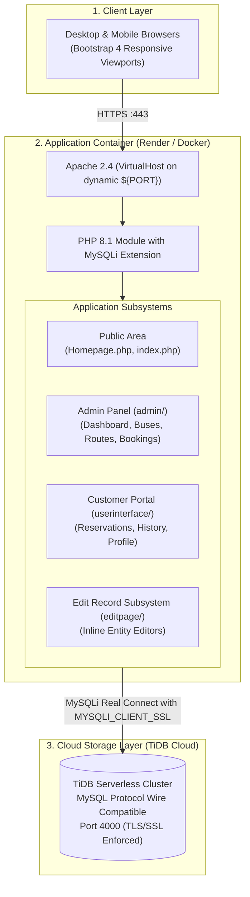

# 🏗️ Architecture & System Design

## 1. System Topology

The Bus Reservation System uses a lightweight, modular monolithic PHP architecture. It operates within a Dockerized Linux runtime running Apache and PHP 8.1, connecting over an encrypted TLS channel to an external serverless MySQL database (TiDB Cloud).



---

## 2. Directory Layout & Modular Responsibilities

The codebase is organized into isolated functional domains:

```
Bus-Resrvation/
├── admin/                  # 👑 Administrator Domain
│   ├── admin.php           # Master layout template (sidebar + breadcrumbs)
│   ├── dashboard.php       # Live analytics aggregation subview
│   ├── buses.php           # Fleet CRUD interface
│   ├── route.php           # Route timetable & pricing management
│   ├── booking.php         # Ticket booking supervision & seat picker
│   ├── costumer.php        # Customer registry table
│   ├── seat.php            # Visual seat map auditor
│   ├── addadmin.php        # Admin provisioning form
│   ├── query.php           # Customer contact messages viewer
│   ├── adminhead.php       # Admin navigation header partial
│   ├── adminfooter.php     # Admin footer JavaScript bundle
│   ├── adminsession.php    # Admin session security guard
│   ├── admin.css           # Admin custom stylesheet
│   └── db_con.php          # Domain database connector bridge
│
├── userinterface/          # 🧑‍💼 Customer Portal Domain
│   ├── admin.php           # Customer dashboard view
│   ├── booking.php         # Customer booking form & visual seat map
│   ├── userbooking.php     # Personal booking history filter view
│   ├── adminhead.php       # Customer header navbar partial
│   ├── adminfooter.php     # Customer footer partial
│   ├── usersession.php     # Customer session guard
│   ├── admin.css           # Customer styling
│   └── db_con.php          # Domain database connector bridge
│
├── editpage/               # ✏️ Edit Records Domain
│   ├── bookingedit.php     # Booking record editor
│   ├── busesedit.php       # Bus number updater
│   ├── costumeredit.php    # Customer profile editor
│   ├── routeedit.php       # Route details & pricing editor
│   ├── header1.php         # Minimal edit header
│   ├── footer.php          # Minimal edit footer
│   ├── edit.css            # Edit form custom stylesheet
│   ├── adminsession.php    # Edit module session guard
│   └── db_con.php          # Domain database connector bridge
│
├── database/               # 🗄️ Database Management
│   └── init.sql            # Master database DDL schema and seed queries
│
├── images/                 # 🖼️ Static Media & Vector Icons
├── Dockerfile              # Containerization definition
├── .dockerignore           # Build exclusions filter
├── .gitignore              # Version control exclusions
├── Homepage.php            # Landing page, login modals & PNR tracker
├── index.php               # Entry redirect handler
├── admin.php               # Root backwards-compatibility redirect shim
├── db_con.php              # Root centralized database connector
├── composer.json           # PHP Composer package definition
└── README.md               # Quickstart documentation
```

---

## 3. Request Lifecycle & Routing

1. **Initial Entry:** A visitor accessing the root URL (`/`) hits `index.php`, which fires an immediate HTTP 302 redirect to `Homepage.php`.
2. **Public Operations:** `Homepage.php` renders the marketing hero section, public PNR lookup form, contact query submission, and modal login dialogs for both administrators and customers.
3. **Authentication Handshake:**
   - **Administrator Login:** Submits credentials against the `admin` table. Upon validation, initializes `$_SESSION['name']`, `$_SESSION['pwd']`, and `$_SESSION['phone']`, then routes to `/admin/admin.php?d=2`.
   - **Customer Login:** Submits credentials against the `costumer` table. Upon validation, initializes session variables and routes to `/userinterface/admin.php?d=2`.
4. **Session Protection:**
   - Every administrative file includes `adminsession.php`.
   - Every customer file includes `usersession.php`.
   - If session variables are unset or invalidated, requests are immediately intercepted and forwarded back to `../Homepage.php`.
5. **Backwards Compatibility:** Legacy links to `/admin.php` are intercepted by the root redirect shim and forwarded to `/admin/admin.php`, preserving all query parameters (`?d=2`).
