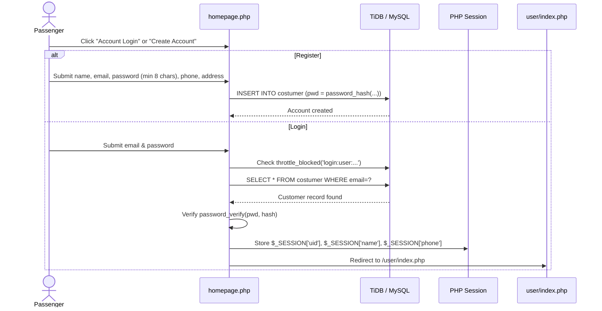

# 🧑‍💼 Customer Portal & Booking Flow

The **Customer Portal** (`user/`) allows passengers to search routes, view real-time seat availability counts, reserve bus seats via an interactive dynamic seat picker, and manage their reservations.

---

## 1. Customer Authentication Flow

---

## 2. Real-Time Route Search & Availability (`user/index.php`)

When passengers search for trips between two cities:
1. The server resolves all active routes matching origin and destination.
2. For each route and date, the system dynamically calculates available seats:
   $$\text{Available Seats} = \text{Bus Capacity} - \text{Booked Seats}(\text{bus}, \text{date}, \text{time})$$
3. Active seats include `Confirmed` and `Pending` reservations. Soft-cancelled and expired hold seats are automatically liberated.
4. If $\text{Available Seats} = 0$, the action button is disabled with a "Sold Out" badge.

---

## 3. Dynamic Interactive Bus Seat Map Engine (`user/booking.php`)

The seat picker dynamically renders the exact capacity of the assigned vehicle (`get_bus_capacity()`, from 10 to 60 seats):

- Available seats render as **Blue** clickable buttons (`btn-info`).
- Already booked or held seats render as **Red** disabled buttons (`btn-danger`).
- Clicking an available seat turns it **Green** (`btn-success`) and populates the validated hidden input field.

---

## 4. Ticket Reservation & Concurrency Defense

1. **Server-Side Price & Departure Time Resolution (F1, F2):** Fare and departure times are read strictly from the database, preventing client-side price tampering.
2. **Date Boundaries (F5):** Travel dates cannot be in the past or more than 90 days in advance. Buses scheduled earlier than the current server time for today cannot be booked.
3. **Atomic Concurrency Defense (F4):** Booking insertions rely on MySQL's unique constraint `uq_booking_seat (bus, date, time, seat)`. Any race condition is caught immediately as duplicate key `1062`, rolling back cleanly and instructing the customer to pick another seat.
4. **Cryptographic PNR Generation:** Uses `random_bytes(5)` to generate a 10-character hex token (e.g. `B4C90A81DE`).
5. **Seat Hold & Payment Lifecycle (O13):**
   - Bookings can enter `Pending` state with a 10-minute hold window (`hold_expires_at`).
   - If not confirmed within 10 minutes, `release_expired_holds()` automatically transitions the state to `Expired`, liberating the seat for other passengers.

---

## 5. Personal Bookings & Soft Cancellation (`user/my-bookings.php`)

Passengers can inspect their travel history strictly bound to their authenticated session ID (`WHERE id = ?`):
- Displays PNR token, bus number, route, departure timestamp, seat badge, status badge, and fare.
- **Cancellation Policy (O4, F7):**
  - Only un-departed future trips can be cancelled (`date >= today`).
  - Cancellation marks `status = 'Cancelled'`, keeping the audit record while instantly releasing the seat for new reservations.

---

## 6. Digital Ticket Verification & HMAC-SHA256 Seal (`user/ticket.php`, `user/verify.php`)

Tickets carry a cryptographically signed verification seal and QR code:
1. **HMAC-SHA256 Signature:** Computed over `PNR|Date|Time|Seat` using `TICKET_HMAC_SECRET` (configured via environment or fallback salt).
2. **Dedicated Validity States:**
   - **`VALID PASS`:** Future departure, confirmed booking status.
   - **`COMPLETED`:** Departed past journey (receipt remains viewable/printable for expense accounting).
   - **`PENDING PAYMENT`:** Seat hold active, awaiting payment confirmation.
   - **`VOID`:** Cancelled or expired reservations (watermarked overlay displayed).
3. **Public QR Code & Verification Endpoint (`user/verify.php`):**
   - Conductors and travelers can scan the QR code to verify the ticket against the live database.
   - Evaluates `hash_equals($expected_sig, $sig)` to detect altered tickets or forge attempts.

---

## 7. Search Usability & Resilience (`user/index.php`)

- **Anchor Auto-Scroll:** When search results load, the view automatically scrolls to `#search-results`.
- **Loading State:** The search button shows a progress spinner on submission while preventing duplicate requests.
- **Departed Journey Sorting:** On same-day searches, departed trips are cleanly sorted below upcoming bookable journeys, accompanied by a same-day schedule note.
- **Swap Cities Validation:** Swapping origins and destinations validates whether the reverse route exists before updating selections, avoiding accidental blank fields.

---

## 8. Public PNR Verification (`homepage.php#pnr`)

Travelers can verify ticket status from the homepage without logging in:
1. Requires the **10-character PNR** and the **last 4 digits of the passenger phone number**.
2. **Rate Limited (O1):** Public lookups are protected against brute-force enumeration:
   - Max 10 attempts per 10 minutes per IP.
   - Max 5 attempts per 15 minutes per target PNR token.
3. Displays live status badge (`Confirmed`, `Pending`, `Expired`, `Cancelled`), passenger initials, route, seat number, and departure time.
