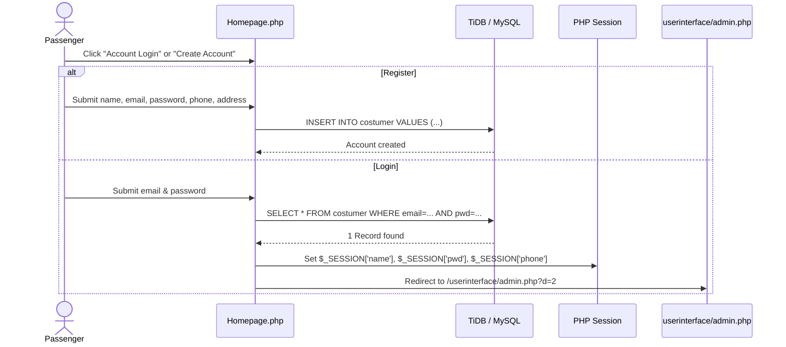

# 🧑‍💼 Customer Portal & Booking Flow

The **Customer Portal** (`userinterface/`) allows passengers to manage their reservations, view booking history, and reserve bus seats using an interactive seat picker.

---

## 1. Customer Authentication Flow



- **Default Test Customer:**
  - **Email:** `user@example.com`
  - **Password:** `user123`

---

## 2. Interactive 36-Seat Bus Map Engine

The booking system features a visual seat map mimicking a standard passenger coach (36 seats arranged in a 2+3 layout across 9 rows):

```
       FRONT OF BUS (Driver)
Row 1:   [ 01 ] [ 02 ]   |AISLE|   [ 03 ] [ 04 ] [ 05 ]
Row 2:   [ 06 ] [ 07 ]   |AISLE|   [ 08 ] [ 09 ] [ 10 ]
Row 3:   [ 11 ] [ 12 ]   |AISLE|   [ 13 ] [ 14 ] [ 15 ]
Row 4:   [ 16 ] [ 17 ]   |AISLE|   [ 18 ] [ 19 ] [ 20 ]
Row 5:   [ 21 ] [ 22 ]   |AISLE|   [ 23 ] [ 24 ] [ 25 ]
Row 6:   [ 26 ] [ 27 ]   |AISLE|   [ 28 ] [ 29 ] [ 30 ]
Row 7:   [ 31 ] [ 32 ]   |AISLE|   [ 33 ] [ 34 ] [ 35 ]
Row 8:   [ 36 ]          |AISLE|   (Rear Entry/Emergency)
```

### How the Seat Picker Interactivity Works:
1. Every seat is represented by an HTML `<button>` styled with Bootstrap class `btn-info` (blue).
2. Clicking a seat executes JavaScript:
   ```javascript
   function fun(seatNumber) {
       document.getElementById('seat_no').value = seatNumber;
   }
   ```
3. The selected seat is recorded into a hidden input field and sent with the POST payload on submit.

---

## 3. Step-by-Step Ticket Reservation Lifecycle

1. **Step 1 — Route Selection:**
   - Passenger selects departure city (`From`) and destination (`To`).
   - Selects an available operational bus number from the dropdown.
2. **Step 2 — Schedule & Date:**
   - Chooses travel date (date picker enforces minimum date of today).
   - Chooses preferred departure time.
3. **Step 3 — Seat Allocation:**
   - Selects an available seat number on the interactive bus grid.
4. **Step 4 — Confirmation & PNR Generation:**
   - Server generates a unique PNR integer using `rand(1, 10000000)`.
   - Inserts record into `booking` table.
   - Confirmation is displayed on screen.

---

## 4. Personal Trip History (`userinterface/userbooking.php`)

Passengers can view their own booked tickets. The view queries bookings filtered by the active session identity:

```sql
SELECT * FROM booking WHERE unm = '$_SESSION[name]'
```

Each record displays:
- **PNR Number**
- **Bus Assigned**
- **From & To Cities**
- **Travel Date & Departure Time**
- **Seat Number**
- **Amount Paid**

---

## 5. Public PNR Lookup (Zero Login Required)

Any passenger can verify their ticket status from the landing page (`Homepage.php`):

1. Passenger enters their numerical **PNR** into the search box.
2. The page queries:
   ```sql
   SELECT * FROM booking WHERE sno = '$pnr_number'
   ```
3. If located, opens the PNR details modal displaying ticket confirmation, route, seat number, and payment status.
