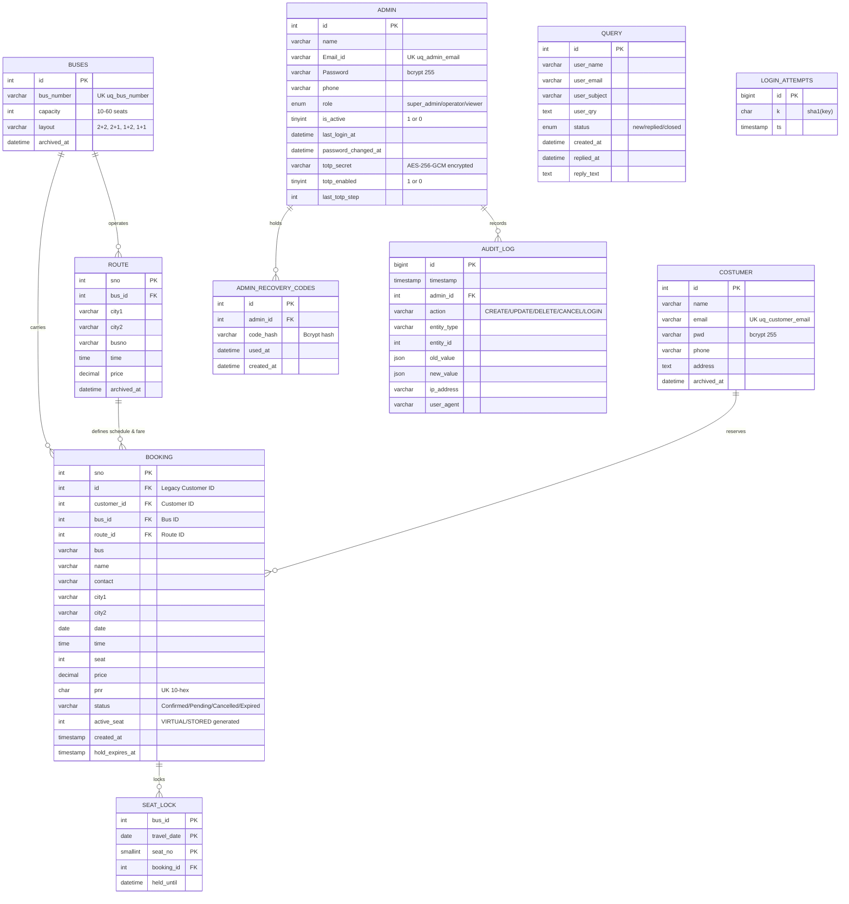

# 🗄️ Database Schema & Models

The application operates on a relational MySQL / TiDB Cloud Serverless schema with automated, idempotent schema migrations managed via `database/db_migrate.php`.

---

## 1. Entity-Relationship Diagram (ERD)

---

## 2. Table Data Dictionaries

### 2.1 Table: `admin`
Stores administrative staff accounts with multi-role RBAC and TOTP 2FA state.

| Column | Type | Nullable | Description |
|---|---|:---:|---|
| `id` | `INT AUTO_INCREMENT` | No | Primary Key |
| `name` | `VARCHAR(100)` | No | Administrator full name |
| `Email_id` | `VARCHAR(100)` | No | Login email (**Unique Key: `uq_admin_email`**) |
| `Password` | `VARCHAR(255)` | No | Bcrypt hashed password (`$2y$`) |
| `phone` | `VARCHAR(20)` | No | Contact phone number |
| `role` | `ENUM('super_admin','operator','viewer')` | No | Role tier (default: `'operator'`) |
| `is_active` | `TINYINT(1)` | No | Account status (default: `1`, `0` = deactivated) |
| `last_login_at` | `DATETIME` | Yes | Timestamp of most recent sign-in |
| `password_changed_at`| `DATETIME` | Yes | Timestamp of last password change (used for session invalidation) |
| `totp_secret` | `VARCHAR(255)` | Yes | Base32 TOTP secret key encrypted at rest via AES-256-GCM |
| `totp_enabled` | `TINYINT(1)` | No | Whether 2FA is active (`1`) or unconfigured (`0`) |
| `last_totp_step` | `INT` | Yes | Most recent verified 30-second time-step (replay protection) |

---

### 2.2 Table: `admin_recovery_codes`
Stores one-time backup recovery codes for two-factor authentication emergency login.

| Column | Type | Nullable | Description |
|---|---|:---:|---|
| `id` | `INT AUTO_INCREMENT` | No | Primary Key |
| `admin_id` | `INT` | No | Foreign Key referencing `admin(id)` |
| `code_hash` | `VARCHAR(255)` | No | Bcrypt hash of 8-character recovery code (`XXXX-XXXX`) |
| `used_at` | `DATETIME` | Yes | Timestamp when the code was consumed (NULL if unused) |
| `created_at` | `DATETIME` | No | Creation timestamp |

---

### 2.3 Table: `seat_lock`
Dedicated atomic concurrency control table preventing seat double-booking across simultaneous browser requests.

| Column | Type | Nullable | Description |
|---|---|:---:|---|
| `bus_id` | `INT` | No | Composite Primary Key (1/3) |
| `travel_date` | `DATE` | No | Composite Primary Key (2/3) |
| `seat_no` | `SMALLINT` | No | Composite Primary Key (3/3) |
| `booking_id` | `INT` | No | Foreign Key referencing `booking(sno)` with `ON DELETE CASCADE` |
| `held_until` | `DATETIME` | Yes | Expiration timestamp for temporary checkout holds |

---

### 2.4 Table: `booking`
Passenger reservations, departure schedule linkages, cryptographic PNR, and payment states.

| Column | Type | Nullable | Description |
|---|---|:---:|---|
| `sno` | `INT AUTO_INCREMENT` | No | Primary Key |
| `pnr` | `CHAR(10)` | No | Cryptographic 10-hex uppercase token (**Unique Key: `uq_booking_pnr`**) |
| `bus_id` | `INT` | Yes | Foreign Key referencing `buses(id)` |
| `route_id` | `INT` | Yes | Foreign Key referencing `route(sno)` |
| `customer_id` | `INT` | Yes | Foreign Key referencing `costumer(id)` |
| `name` | `VARCHAR(100)` | No | Passenger name |
| `contact` | `VARCHAR(20)` | No | Passenger contact phone |
| `city1` | `VARCHAR(100)` | No | Origin city |
| `city2` | `VARCHAR(100)` | No | Destination city |
| `date` | `DATE` | No | Journey date |
| `time` | `TIME` | No | Departure time |
| `seat` | `INT` | No | Assigned seat number |
| `price` | `DECIMAL(10,2)` | No | Fare charged |
| `status` | `VARCHAR(20)` | No | Reservation state: `'Confirmed'`, `'Pending'`, `'Cancelled'`, `'Expired'` |
| `active_seat` | `INT` | Yes | Generated column: evaluates to `seat` for Confirmed/Pending; `NULL` for Cancelled/Expired (**Unique Key: `uq_booking_active_seat`**) |
| `created_at` | `TIMESTAMP` | No | Reservation timestamp |
| `hold_expires_at` | `TIMESTAMP` | Yes | Temporary checkout hold expiration |

> **TiDB Cloud Compatibility Note:** TiDB does not allow adding `STORED` generated columns via `ALTER TABLE`. `database/db_migrate.php` implements an automated fallback to `VIRTUAL` generated columns, preserving complete unique constraint semantics on `(bus, date, time, active_seat)` across both MySQL and TiDB Cloud.

---

### 2.5 Table: `buses`
Fleet transit vehicles, seating capacities, and layout geometries.

| Column | Type | Nullable | Description |
|---|---|:---:|---|
| `id` | `INT AUTO_INCREMENT` | No | Primary Key |
| `bus_number` | `VARCHAR(50)` | No | License/identifier (**Unique Key: `uq_bus_number`**) |
| `capacity` | `INT` | No | Seat capacity (`10` to `60`, default: `36`) |
| `layout` | `VARCHAR(8)` | No | Seating geometry: `'2+2'`, `'2+1'`, `'1+2'`, `'1+1'` |
| `archived_at` | `DATETIME` | Yes | Soft-delete timestamp (NULL = active) |

---

### 2.6 Table: `route`
Intercity travel timetables and tariffs.

| Column | Type | Nullable | Description |
|---|---|:---:|---|
| `sno` | `INT AUTO_INCREMENT` | No | Primary Key |
| `bus_id` | `INT` | Yes | Foreign Key referencing `buses(id)` |
| `city1` | `VARCHAR(100)` | No | Origin city |
| `city2` | `VARCHAR(100)` | No | Destination city |
| `busno` | `VARCHAR(50)` | No | Vehicle identifier |
| `time` | `TIME` | No | Departure time |
| `price` | `DECIMAL(10,2)` | No | Standard fare tariff |
| `archived_at` | `DATETIME` | Yes | Soft-delete timestamp (NULL = active) |

---

### 2.7 Table: `audit_log`
Immutable, append-only compliance audit trail.

| Column | Type | Nullable | Description |
|---|---|:---:|---|
| `id` | `BIGINT AUTO_INCREMENT` | No | Primary Key |
| `timestamp` | `TIMESTAMP` | No | Event timestamp (UTC/Local) |
| `admin_id` | `INT` | Yes | Foreign Key referencing `admin(id)` |
| `action` | `VARCHAR(50)` | No | Event action (`CREATE`, `UPDATE`, `DELETE`, `CANCEL`, `LOGIN`, `MFA_ENABLE`) |
| `entity_type` | `VARCHAR(50)` | No | Target entity (`admin`, `bus`, `route`, `booking`, `customer`) |
| `entity_id` | `INT` | Yes | Target entity identifier |
| `old_value` | `JSON` | Yes | Snapshot before mutation |
| `new_value` | `JSON` | Yes | Snapshot after mutation |
| `ip_address` | `VARCHAR(45)` | No | Client IP address (IPv4/IPv6) |
| `user_agent` | `VARCHAR(255)` | Yes | Browser User-Agent header |

---

### 2.8 Table: `query`
Customer inquiries and support feedback.

| Column | Type | Nullable | Description |
|---|---|:---:|---|
| `id` | `INT AUTO_INCREMENT` | No | Primary Key |
| `user_name` | `VARCHAR(100)` | No | Customer sender name |
| `user_email` | `VARCHAR(100)` | No | Customer email address |
| `user_subject`| `VARCHAR(200)` | Yes | Inquiry subject line |
| `user_qry` | `TEXT` | No | Customer inquiry body |
| `status` | `ENUM('new','replied','closed')` | No | Lifecycle status (default: `'new'`) |
| `created_at` | `DATETIME` | No | Submission timestamp |
| `replied_at` | `DATETIME` | Yes | Timestamp of email reply dispatch |
| `reply_text` | `TEXT` | Yes | Sent email reply body |

---

## 3. Database Migration Sequence

The schema runner (`database/db_migrate.php`) tracks and executes 10 sequential migrations idempotently:

| Step | Migration File / Key | Scope |
|---|---|---|
| `001` | `001_hardening_and_schema_updates` | Bcrypt column widths, PNR unique keys, self-healing `admin.role` |
| `002` | `002_rehash_legacy_passwords` | Transparent hashing of legacy plaintext passwords |
| `003` | `003_bus_capacity` | Adds `capacity` column to fleet vehicles (10–60 seats) |
| `004` | `004_seat_hold_and_payment_states` | Adds `created_at` and `hold_expires_at` for checkout holds |
| `005` | `005_rebookable_active_seats` | Adds `active_seat` and `uq_booking_active_seat` (TiDB fallback) |
| `006` | `006_bus_layout` | Adds `layout` column for customizable seating layouts |
| `007` | `007_referential_integrity_and_seat_locks` | Adds `seat_lock` table, foreign keys (`bus_id`, `route_id`), and backfill |
| `008` | `008_audit_logging` | Creates `audit_log` table with database triggers |
| `009` | `009_admin_accounts_and_soft_delete` | Adds `is_active`, `totp_*`, `admin_recovery_codes`, and `archived_at` |
| `010` | `010_query_inbox_enhancements` | Adds `status`, `reply_text`, and timestamps to customer support inbox |
