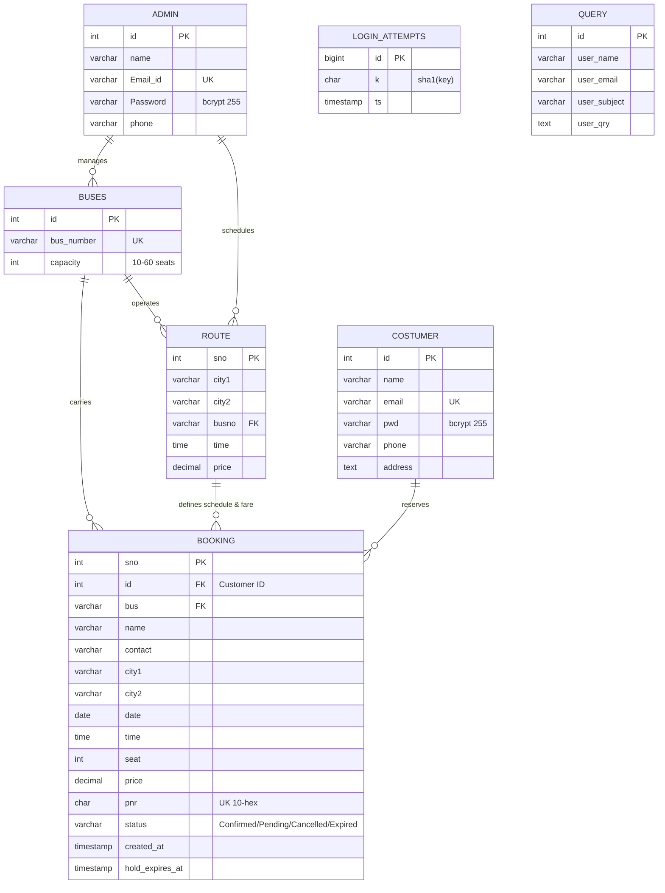

# 🗄️ Database Schema & Models

The system operates on a relational MySQL / TiDB Cloud schema. It includes 7 entity tables with automated, idempotent schema migrations managed via `database/db_migrate.php`.

---

## 1. Entity-Relationship Diagram (ERD)

---

## 2. Table Data Dictionaries

### 2.1 Table: `admin`
Stores system administrators who have permission to access the control panel (`admin/`). Passwords are cryptographically hashed using PHP `PASSWORD_DEFAULT` (bcrypt).

| Column | Type | Nullable | Description |
|---|---|:---:|---|
| `id` | `INT AUTO_INCREMENT` | No | Primary Key |
| `name` | `VARCHAR(100)` | No | Administrator full name |
| `Email_id` | `VARCHAR(100)` | No | Administrator login email (**Unique Key: `uq_admin_email`**) |
| `Password` | `VARCHAR(255)` | No | Bcrypt hashed password (255 chars) |
| `phone` | `VARCHAR(20)` | No | Phone contact number |

### 2.2 Table: `costumer`
Customer accounts registered through the public portal or added manually by administrators.

| Column | Type | Nullable | Description |
|---|---|:---:|---|
| `id` | `INT AUTO_INCREMENT` | No | Primary Key |
| `name` | `VARCHAR(100)` | No | Full name |
| `email` | `VARCHAR(100)` | No | Customer login email address (**Unique Key: `uq_customer_email`**) |
| `pwd` | `VARCHAR(255)` | No | Bcrypt hashed password (255 chars) |
| `phone` | `VARCHAR(20)` | No | Primary telephone number |
| `address` | `TEXT` | Yes | Postal/Residential address |

### 2.3 Table: `buses`
Inventory of buses registered in the operator fleet, with configurable seat capacity (O8).

| Column | Type | Nullable | Description |
|---|---|:---:|---|
| `id` | `INT AUTO_INCREMENT` | No | Primary Key |
| `bus_number` | `VARCHAR(50)` | No | Bus registration / license code (**Unique Key: `uq_bus_number`**) |
| `capacity` | `INT` | No | Passenger seat capacity (Default `36`, valid `10`–`60`) |

### 2.4 Table: `route`
Defines operational trips connecting two distinct cities with scheduled departure times and fares.

| Column | Type | Nullable | Description |
|---|---|:---:|---|
| `sno` | `INT AUTO_INCREMENT` | No | Primary Key |
| `city1` | `VARCHAR(100)` | No | Origin city |
| `city2` | `VARCHAR(100)` | No | Destination city (`city1 != city2` enforced) |
| `busno` | `VARCHAR(50)` | No | Assigned vehicle (Index: `idx_route_bus`) |
| `time` | `TIME` | No | Scheduled departure time |
| `price` | `DECIMAL(10,2)` | No | Base ticket price for this journey |

### 2.5 Table: `booking`
Passenger reservations. Concurrency is strictly enforced via unique compound constraint `uq_booking_seat(bus, date, time, seat)`.

| Column | Type | Nullable | Description |
|---|---|:---:|---|
| `sno` | `INT AUTO_INCREMENT` | No | Internal surrogate Primary Key |
| `id` | `INT` | No | Customer account ID (Session `uid`) |
| `bus` | `VARCHAR(50)` | No | Bus code for journey |
| `name` | `VARCHAR(100)` | No | Passenger name |
| `contact` | `VARCHAR(20)` | No | Passenger contact phone number |
| `city1` | `VARCHAR(100)` | No | Boarding city |
| `city2` | `VARCHAR(100)` | No | Destination city |
| `date` | `DATE` | No | Date of journey |
| `time` | `TIME` | No | Scheduled departure time |
| `seat` | `INT` | No | Allocated seat number (1 through bus capacity) |
| `price` | `DECIMAL(10,2)` | No | Ticket amount charged |
| `pnr` | `CHAR(10)` | No | Unpredictable 10-hex uppercase PNR token (**Unique Key: `uq_booking_pnr`**) |
| `status` | `VARCHAR(20)` | No | State: `Confirmed`, `Pending`, `Cancelled`, `Expired` |
| `created_at` | `TIMESTAMP` | No | Timestamp of reservation creation |
| `hold_expires_at` | `TIMESTAMP` | Yes | Hold expiration deadline (10 min for `Pending` state) |

### 2.6 Table: `login_attempts`
Ephemeral rate limiting store for brute-force defense against logins and PNR lookups.

| Column | Type | Nullable | Description |
|---|---|:---:|---|
| `id` | `BIGINT AUTO_INCREMENT` | No | Primary Key |
| `k` | `CHAR(40)` | No | SHA-1 hashed rate limit key (IP or target token) |
| `ts` | `TIMESTAMP` | No | Hit timestamp (Pruned after 24 hours) |

### 2.7 Table: `query`
Public feedback and contact inquiries submitted from the homepage contact section.

| Column | Type | Nullable | Description |
|---|---|:---:|---|
| `id` | `INT AUTO_INCREMENT` | No | Primary Key |
| `user_name` | `VARCHAR(100)` | No | Sender name |
| `user_email` | `VARCHAR(100)` | No | Sender email address |
| `user_subject` | `VARCHAR(200)` | Yes | Inquiry topic |
| `user_qry` | `TEXT` | No | Message body |

---

## 3. Database Migration Runner (`database/db_migrate.php`)

Database modifications are managed through an idempotent runner tracking executions in `schema_migrations`:
- `001_hardening_and_schema_updates`: Credential widening, unique email & bus indexes, PNR column, seat uniqueness constraint.
- `002_rehash_legacy_passwords`: One-way rehashing of legacy plaintext credentials to bcrypt.
- `003_bus_capacity`: Adds dynamic fleet capacity column (`capacity`) defaulting to 36 seats.
- `004_seat_hold_and_payment_states`: Adds `created_at`, `hold_expires_at`, and `idx_booking_hold` index.
