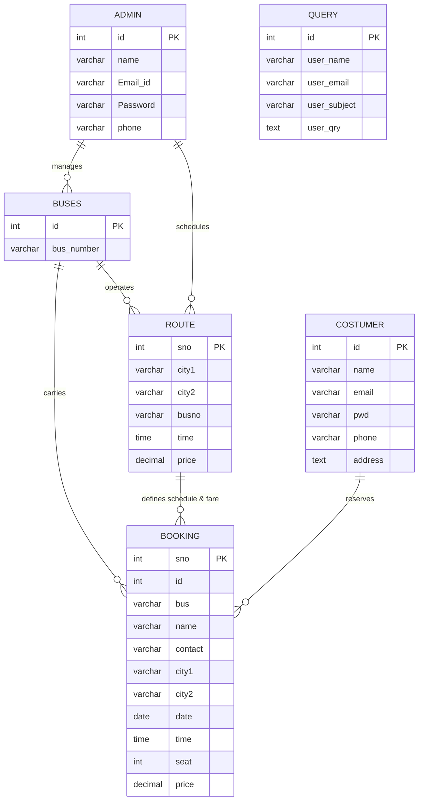

# 🗄️ Database Schema & Models

The system operates on a relational MySQL schema named `test` (or `majorproject`). It includes 6 core entity tables.

---

## 1. Entity-Relationship Diagram (ERD)



---

## 2. Table Data Dictionaries

### 2.1 Table: `admin`
Stores system administrators who have permission to access the control panel (`admin/`).

| Column | Type | Nullable | Description |
|---|---|:---:|---|
| `id` | `INT AUTO_INCREMENT` | No | Primary Key |
| `name` | `VARCHAR(100)` | No | Administrator full name |
| `Email_id` | `VARCHAR(100)` | No | Administrator login email |
| `Password` | `VARCHAR(100)` | No | Administrator password |
| `phone` | `VARCHAR(20)` | No | Phone contact number |

### 2.2 Table: `costumer`
Customer accounts registered through the public portal or added manually by administrators.

| Column | Type | Nullable | Description |
|---|---|:---:|---|
| `id` | `INT AUTO_INCREMENT` | No | Primary Key |
| `name` | `VARCHAR(100)` | No | Full name (concatenated first + last name) |
| `email` | `VARCHAR(100)` | No | Customer login email address |
| `pwd` | `VARCHAR(100)` | No | Customer password |
| `phone` | `VARCHAR(20)` | No | Primary telephone number |
| `address` | `TEXT` | Yes | Postal/Residential address |

### 2.3 Table: `buses`
Inventory of buses registered in the operator fleet.

| Column | Type | Nullable | Description |
|---|---|:---:|---|
| `id` | `INT AUTO_INCREMENT` | No | Primary Key |
| `bus_number` | `VARCHAR(50)` | No | License plate or operational bus code (e.g. `HR-001`) |

> **Note:** The system models a 36-seat layout per vehicle. Total system seat capacity is calculated dynamically in the dashboard as `COUNT(buses) * 36`.

### 2.4 Table: `route`
Defines operational trips connecting two cities with scheduled times and fares.

| Column | Type | Nullable | Description |
|---|---|:---:|---|
| `sno` | `INT AUTO_INCREMENT` | No | Primary Key |
| `city1` | `VARCHAR(100)` | No | Origin city (Departure hub) |
| `city2` | `VARCHAR(100)` | No | Destination city (Arrival hub) |
| `busno` | `VARCHAR(50)` | No | Assigned vehicle (Matches `buses.bus_number`) |
| `time` | `TIME` | No | Departure time schedule |
| `price` | `DECIMAL(10,2)` | No | Base ticket price for this journey |

### 2.5 Table: `booking`
Passenger reservations. Contains trip itinerary, seat allocation, passenger contact, and PNR identifier.

| Column | Type | Nullable | Description |
|---|---|:---:|---|
| `sno` | `INT AUTO_INCREMENT` | No | Primary Key |
| `id` | `INT` | No | Passenger Name Record (PNR number) |
| `bus` | `VARCHAR(50)` | No | Bus number for the journey |
| `name` | `VARCHAR(100)` | No | Passenger name |
| `contact` | `VARCHAR(20)` | No | Passenger contact phone number |
| `city1` | `VARCHAR(100)` | No | Boarding city |
| `city2` | `VARCHAR(100)` | No | Destination city |
| `date` | `DATE` | No | Date of journey |
| `time` | `TIME` | No | Scheduled departure time |
| `seat` | `INT` | No | Allocated seat number (1 through 36) |
| `price` | `DECIMAL(10,2)` | No | Ticket amount charged |

### 2.6 Table: `query`
Public feedback and contact inquiries submitted from the homepage contact section.

| Column | Type | Nullable | Description |
|---|---|:---:|---|
| `id` | `INT AUTO_INCREMENT` | No | Primary Key |
| `user_name` | `VARCHAR(100)` | No | Sender name |
| `user_email` | `VARCHAR(100)` | No | Sender email address |
| `user_subject` | `VARCHAR(200)` | Yes | Inquiry topic |
| `user_qry` | `TEXT` | No | Message body |

---

## 3. Default Seed Data

Executing [`database/init.sql`](https://github.com/Jashan-randhawa/Bus-Resrvation/blob/main/database/init.sql) seeds the following demo credentials:

```sql
INSERT INTO `admin` (`name`, `Email_id`, `Password`, `phone`)
VALUES ('Admin', 'admin@example.com', 'admin123', '1234567890');

INSERT INTO `costumer` (`name`, `email`, `pwd`, `phone`)
VALUES ('Test User', 'user@example.com', 'user123', '9876543210');
```
