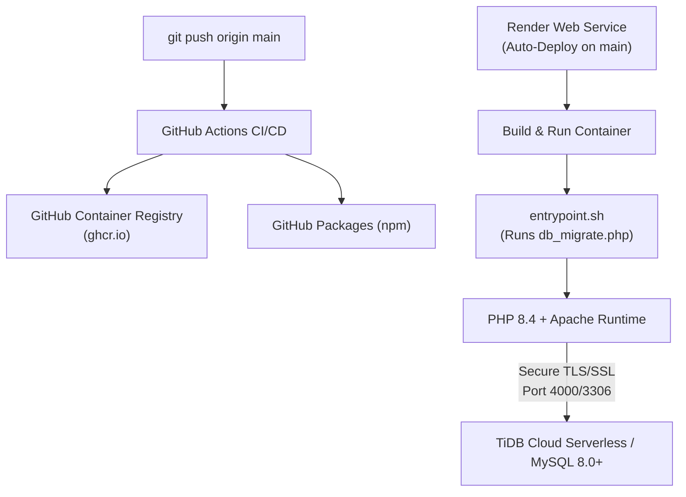

# 🐳 Deployment & DevOps

This guide outlines the production deployment lifecycle, container specifications, environment configuration catalog, standalone migration runner, and automated CI/CD package publishing pipeline.

---

## 1. Cloud Infrastructure Architecture



---

## 2. Docker Container Specification (`Dockerfile`)

The production container uses official PHP 8.4 Apache base images, hardened with Apache security configurations and dynamic PORT binding:

```dockerfile
FROM php:8.4-apache

ENV PORT=80

RUN docker-php-ext-install mysqli \
 && a2enmod rewrite headers \
 && mv "$PHP_INI_DIR/php.ini-production" "$PHP_INI_DIR/php.ini"

COPY docker/php-extra.ini "$PHP_INI_DIR/conf.d/zz-app.ini"
COPY docker/apache-security.conf /etc/apache2/conf-available/security-extra.conf

# Dynamic PORT binding for Render / Cloud Orchestrators
RUN echo "ServerName localhost" > /etc/apache2/conf-available/servername.conf \
 && a2enconf servername security-extra \
 && sed -ri 's/Listen 80/Listen ${PORT}/' /etc/apache2/ports.conf \
 && sed -ri 's#<VirtualHost \*:80>#<VirtualHost *:${PORT}>#' /etc/apache2/sites-available/000-default.conf

COPY docker/entrypoint.sh /usr/local/bin/entrypoint.sh
RUN chmod +x /usr/local/bin/entrypoint.sh

COPY --chown=www-data:www-data . /var/www/html/

EXPOSE 80

HEALTHCHECK --interval=30s --timeout=5s --retries=3 \
 CMD curl -fsS -o /dev/null "http://localhost:${PORT}/index.php" || exit 1

ENTRYPOINT ["/usr/local/bin/entrypoint.sh"]
CMD ["apache2-foreground"]
```

---

## 3. Environment Variables Catalog

All credentials, policies, and operational switches are injected via environment variables:

| Variable | Default | Description | Example Value |
|---|---|---|---|
| `DB_HOST` | `localhost` | Database Hostname / Gateway | `gateway01.ap-south-1.prod.aws.tidbcloud.com` |
| `DB_PORT` | `3306` | Database Port | `4000` (TiDB) or `3306` (MySQL) |
| `DB_USER` | `root` | Database Username | `3jU2AFK6LAM8fGW.root` |
| `DB_PASS` | *(empty)* | Database Password | `your_secure_password` |
| `DB_NAME` | `bus_reservation` | Database Catalog Name | `test` or `majorproject` |
| `DB_SSL` | `false` | Enable TLS/SSL Connection | `true` |
| `PORT` | `80` | Web Server Listen Port | `10000` (Render) or `80` |
| `MIGRATE_ON_START` | `1` | Automatically run migrations on boot | `1` (enabled) or `0` (disabled) |
| `ADMIN_MFA_ENFORCE` | `false` | Enforce 2FA on admin dashboard access | `false` (optional) or `true` (mandatory) |
| `APP_BOOKING_CUTOFF_MIN` | `30` | Minimum minutes before departure to book | `30` |
| `APP_CANCEL_CUTOFF_MIN` | `120` | Minimum minutes before departure to cancel | `120` |
| `APP_TZ` | `Asia/Kolkata` | Application Timezone | `Asia/Kolkata` |
| `APP_CURRENCY` | `₹` | Currency symbol | `₹` or `$` |
| `APP_DEBUG` | `0` | Expose error traces to super admins | `0` (off) or `1` (on) |
| `BASE_URL` | *(auto)* | Root URL path | `""` (web root) or `"/bus-reservation"` |
| `MAIL_ENABLED` | `false` | Enable RFC 5321 SMTP email dispatch | `true` |
| `MAIL_HOST` | *(empty)* | Outbound SMTP Relay Host | `smtp.example.com` |
| `MAIL_PORT` | `587` | SMTP Relay Port | `587` |
| `MAIL_USER` | *(empty)* | SMTP Username / API Key | `apikey` |
| `MAIL_PASS` | *(empty)* | SMTP Secret Key | `your_smtp_secret` |
| `MAIL_FROM` | *(empty)* | Outbound From Address | `reservations@example.com` |
| `MAIL_FROM_NAME` | `"Bus Reservation System"` | Outbound Sender Name | `"Bus Reservation System"` |

---

## 4. Production Deployment on Render

1. **Create Web Service:** Go to [dashboard.render.com](https://dashboard.render.com) &rarr; **New +** &rarr; **Web Service**.
2. **Connect Repository:** Select `Jashan-randhawa/Bus-Resrvation`.
3. **Runtime:** Select **Docker**.
4. **Environment Variables:** Populate `DB_HOST`, `DB_PORT`, `DB_USER`, `DB_PASS`, `DB_NAME`, and `DB_SSL=true`.
5. **Auto-Deploy:** On every `git push origin main`, Render builds the Dockerfile, runs `entrypoint.sh` (executing `db_migrate.php` to apply all migrations), and starts Apache.

---

## 5. Standalone Database Migration Runner

For one-off schema migrations or CI/CD pre-deploy tasks, use the dedicated migration runner image (`docker/Dockerfile.migrate`):

```bash
docker pull ghcr.io/jashan-randhawa/bus-resrvation-migrate:latest

docker run --rm \
  -e DB_HOST=gateway01.ap-south-1.prod.aws.tidbcloud.com \
  -e DB_PORT=4000 \
  -e DB_USER=your_user \
  -e DB_PASS=your_password \
  -e DB_NAME=test \
  -e DB_SSL=true \
  ghcr.io/jashan-randhawa/bus-resrvation-migrate:latest
```

---

## 6. GitHub Packages Distribution

The repository publishes pre-built distribution packages to **GitHub Packages**:

| Package | Registry | Description |
|---|---|---|
| **🐳 Docker App Container** | `ghcr.io/jashan-randhawa/bus-resrvation` | Production app container image |
| **⚡ Migration Runner** | `ghcr.io/jashan-randhawa/bus-resrvation-migrate` | Standalone CLI database migration image |
| **💺 Seat Picker Widget** | `@jashan-randhawa/bus-seat-picker` | Standalone accessible seat selection widget |
| **🎨 BusRes UI & Tokens** | `@jashan-randhawa/busres-ui` | Shared design tokens, styles, and dark mode |

### Installing npm Packages:

Configure your `.npmrc`:
```ini
@jashan-randhawa:registry=https://npm.pkg.github.com
//npm.pkg.github.com/:_authToken=${GITHUB_TOKEN}
```

```bash
npm install @jashan-randhawa/bus-seat-picker
npm install @jashan-randhawa/busres-ui
```
