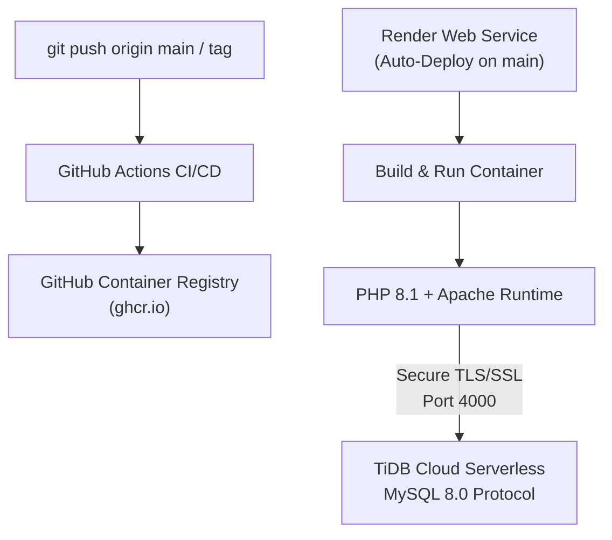

# 🐳 Deployment & DevOps

This guide outlines the production deployment lifecycle, container specifications, and automated CI/CD package publishing pipeline.

---

## 1. Cloud Infrastructure Architecture



---

## 2. Docker Container Specification (`Dockerfile`)

The container utilizes official PHP 8.1 Apache base images, optimized for cloud platform dynamic ports:

```dockerfile
FROM php:8.1-apache

# Install MySQLi extension
RUN docker-php-ext-install mysqli && docker-php-ext-enable mysqli

# Enable Apache mod_rewrite
RUN a2enmod rewrite

# Enable output buffering in PHP to prevent 'headers already sent' issues
RUN echo "output_buffering = 4096" > /usr/local/etc/php/conf.d/output-buffering.ini

# Copy project files into Apache document root
COPY . /var/www/html/

# Permissions
RUN chown -R www-data:www-data /var/www/html \
    && chmod -R 755 /var/www/html

# Dynamic PORT binding for Render / Cloud Orchestrators
RUN sed -i 's/Listen 80/Listen ${PORT}/g' /etc/apache2/ports.conf \
    && sed -i 's/:80/:${PORT}/g' /etc/apache2/sites-available/000-default.conf

EXPOSE 10000
CMD ["apache2-foreground"]
```

---

## 3. Environment Variables Reference

All credentials and configurations are injected via environment variables at container startup:

| Environment Variable | Description | Example Value |
|---|---|---|
| `DB_HOST` | Database Hostname | `gateway01.ap-south-1.prod.aws.tidbcloud.com` |
| `DB_PORT` | Database Port | `4000` (TiDB) or `3306` (MySQL) |
| `DB_USER` | Database Username | `3jU2AFK6LAM8fGW.root` |
| `DB_PASS` | Database Password | `your_secure_password` |
| `DB_NAME` | Database Schema Name | `test` or `majorproject` |
| `DB_SSL` | Enable TLS/SSL Connection | `true` |
| `PORT` | Web Server Listen Port | `10000` (Render default) or `80` |

---

## 4. Production Deployment on Render

1. **Create Web Service:** Go to [dashboard.render.com](https://dashboard.render.com) &rarr; **New +** &rarr; **Web Service**.
2. **Connect Repository:** Select `Jashan-randhawa/Bus-Resrvation`.
3. **Runtime:** Select **Docker**.
4. **Instance Type:** Select **Free**.
5. **Environment Variables:** Populate `DB_HOST`, `DB_PORT`, `DB_USER`, `DB_PASS`, `DB_NAME`, and `DB_SSL=true`.
6. **Deploy:** Render automatically builds the Dockerfile and starts the container.

---

## 5. GitHub Packages (GHCR) Distribution

The repository publishes pre-built container images to the **GitHub Container Registry (GHCR)** via GitHub Actions (`.github/workflows/docker-publish.yml`):

### Pull & Run the Published Container:

```bash
# Pull the latest image
docker pull ghcr.io/jashan-randhawa/bus-resrvation:latest

# Run container with TiDB Cloud credentials
docker run -d -p 8080:80 \
  -e DB_HOST=gateway01.ap-south-1.prod.aws.tidbcloud.com \
  -e DB_PORT=4000 \
  -e DB_USER=your_user \
  -e DB_PASS=your_password \
  -e DB_NAME=test \
  -e DB_SSL=true \
  --name bus-app \
  ghcr.io/jashan-randhawa/bus-resrvation:latest
```
Access at `http://localhost:8080`.
